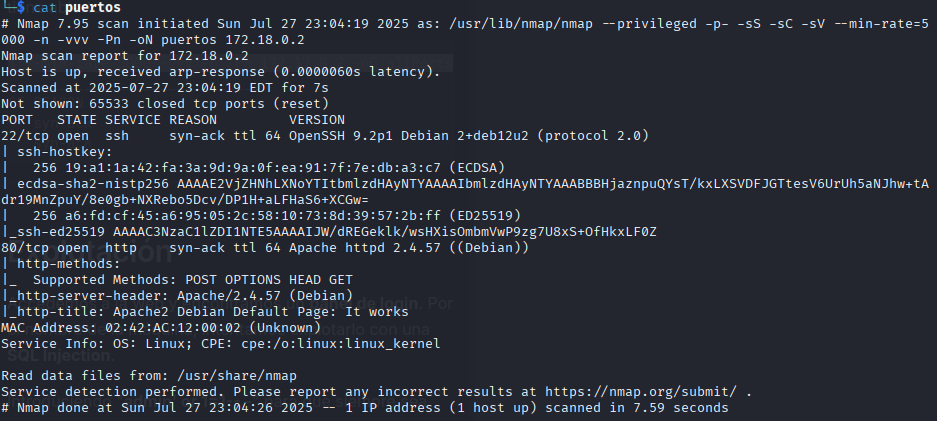

# Trust

## Conectividad

Primero compruebo si tengo conectividad con la víctima.

---

## Escaneo Nmap

Luego de comprobar la conectividad, realizo un escaneo general de la red utilizando el siguiente comando:

sudo nmap -p- -sS -sC -sV --min-rate=5000 -n -vvv -Pn 172.17.0.2 -oN puertos

Gracias a este escaneo pude identificar que los puertos abiertos en la máquina víctima son:

- `80/tcp` → Servicio HTTP
- `22/tcp` → Servicio SSH
